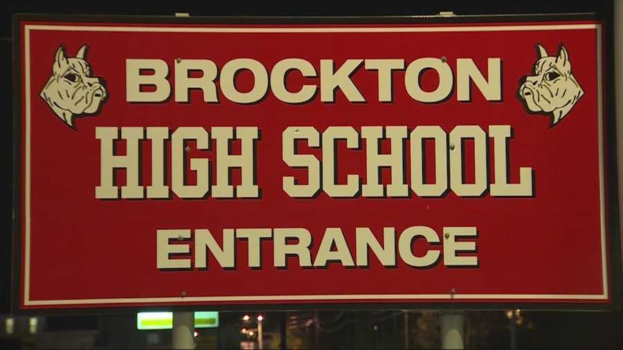

# About Alex Almeida
- **Name**: Alexander Almeida
- **Graduating from BHS**: 2021

# Summary 
Hello, my name is Alexander Almeida, but I go by Alex. I am a junior at the Brockton High School.

This year I am trying to better myself in both fitness level, academic level and just trying to make myself more well rounded for the future. After school I drive around for Driver's ed. I enjoy playing the sport volleyball and I am going to be trying out for the JV team this year. I really enjoy Marvel movies and other projects done by Disney.
# Family
Me and my family have lived solely on the East side of Brockton. I have two brothers one older and one younger. 

- My older brother Robert is currently a sophomore in college at the Becker College in Lecister.
- My younger brother is in the 8th grade at the Ashfield Middle School.

My father is a mason working for my grandfather in his business Andrews Masonry.

My mother works at a daycare in Braintree called Hugs Plus Learning Center, where she is a teacher's assistant.
# Skills
- Spelling Bee Champion in 5th grade
- Understands some Spanish
- Can do a cartwheel with one hand
- Can cartwheel off of a balnace beam
- Can do a handstand in and out of water
# Culture
My father is Portuguese and in turn I have leanred some portuguese from my grandmother. We celebrate holidays, such as Christmas a day earlier on Christmas Eve because where they are from it is Christmas then.
# Favorite Website
1. [Coolmath](https://www.coolmathgames.com/)

2. [Youtube](https://youtube.com)
